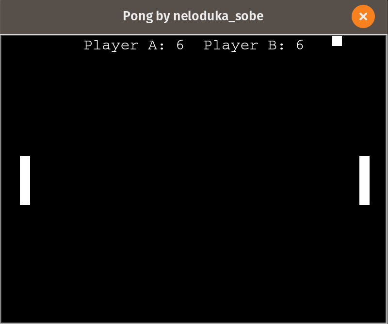

# Pong Game OOP
Pong based on Atari game from 1972, written in python3 using turtle graphics module.
### Game Window

### Controls

**Player A**

`To move up: w`

`To move down: s`
 
 **Player B**
 
`To move up: Up Arrow`

`To move down: Down Arrow`

### Dependiences
 1. Python v3.x
 2. Turtle module
